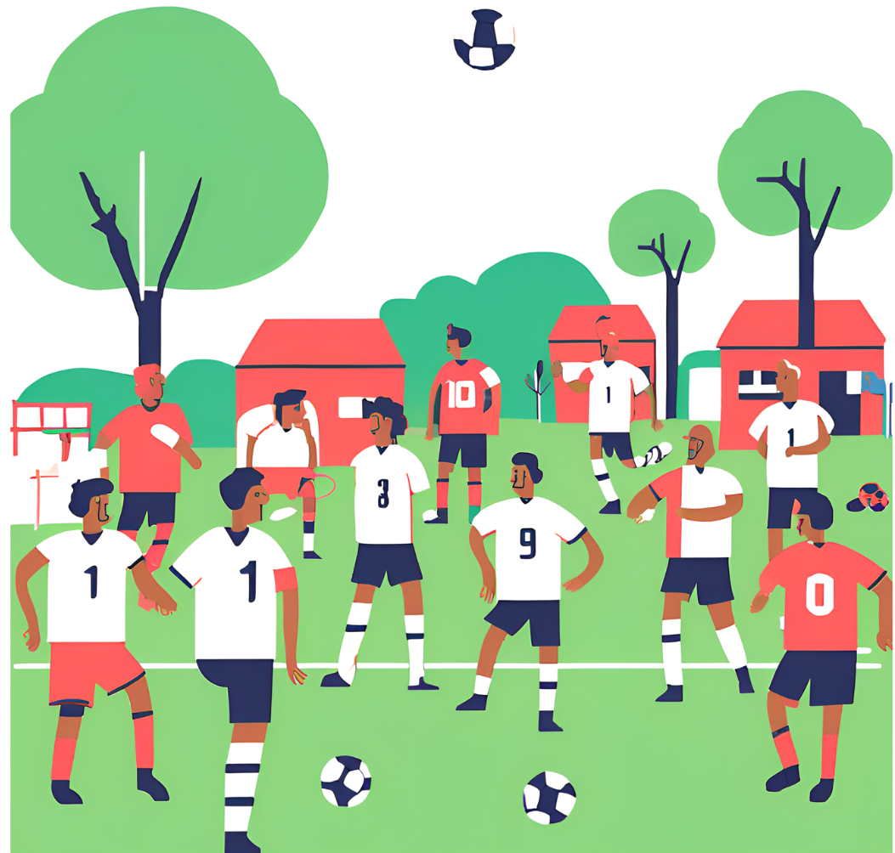

```{r setup, include=FALSE}

knitr::opts_chunk$set(echo = FALSE)

# Learn more about creating websites with Distill at:
# https://rstudio.github.io/distill/website.html

library(ggplot2)
library(tidyverse)
library(hrbrthemes)
library(viridis)
library(googlesheets4)
library(ggwordcloud)
library(DT)


```


განათლებასთან ერთად ჯანსაღი ცხოვრების წახალისებაც მნიშვნელოვანია, შესაბამისად გადავწყვიტეთ მხარ დავუჭიროთ ონტოფოს სტადიონის საფეხბურთო სეზონისთვის მომზადებას.

ონტოფოში, ფეხბურთის სეზონი ივლისის მესამე კვირიდან იწყება. ამ დღეებისთვის ყველა ვემზადებით. 
ჩვენი საამაყო სტადიონის მოსაწესრიგებლად ყველა დარაზმულია და ჩვენც გადავწყვიტეთ ამ პროცესში ჩვენი წვლილი შევიტანოთ. 

ქრაუდფანდინგის კამპანიის ფარგლებში შეგროვებული ბიუჯეტით (524 ₾)  შევიძინეთ კარების ბადე და xxxx. ხარჯების დეტალები იხ. ბმულზე.

იდეის ფინანსური მხარდამჭერები 👇

```{r echo = FALSE, message = FALSE, warning=FALSE, fig.height = 3.4, fig.width = 8, dev.args=list(bg='transparent', pointsize=10)}


statement <- read.csv("/Users/macbook/Documents/R/ggplot/OnLaibrary/data/statement.csv")


orbelianimeti <- read.csv("/Users/macbook/Documents/R/ggplot/OnLaibrary/data/orbelianimeti.csv")


statement_income <- statement |>
             dplyr::filter(source == "სტადიონისთვის") |>
    dplyr::distinct(name) |>
    arrange((name))
  


Table <- datatable(statement_income,  colnames = c("N", "სახელი, გვარი"),
          clas='hover cell-border stripe dt-head-right',
          options = list(searching=FALSE, pageLength=15, dom='Bfrtip'))
Table
```

სოფლის სტადიონის განახლების პროცესში ონტოფელები აქტიურად არიან ჩართულები. ეს გახდა ჩვენი მოტივაცია ჩვენი (თქვენთან ერთად)  წვლილი შეგვეტანა ამ პროცესში.


