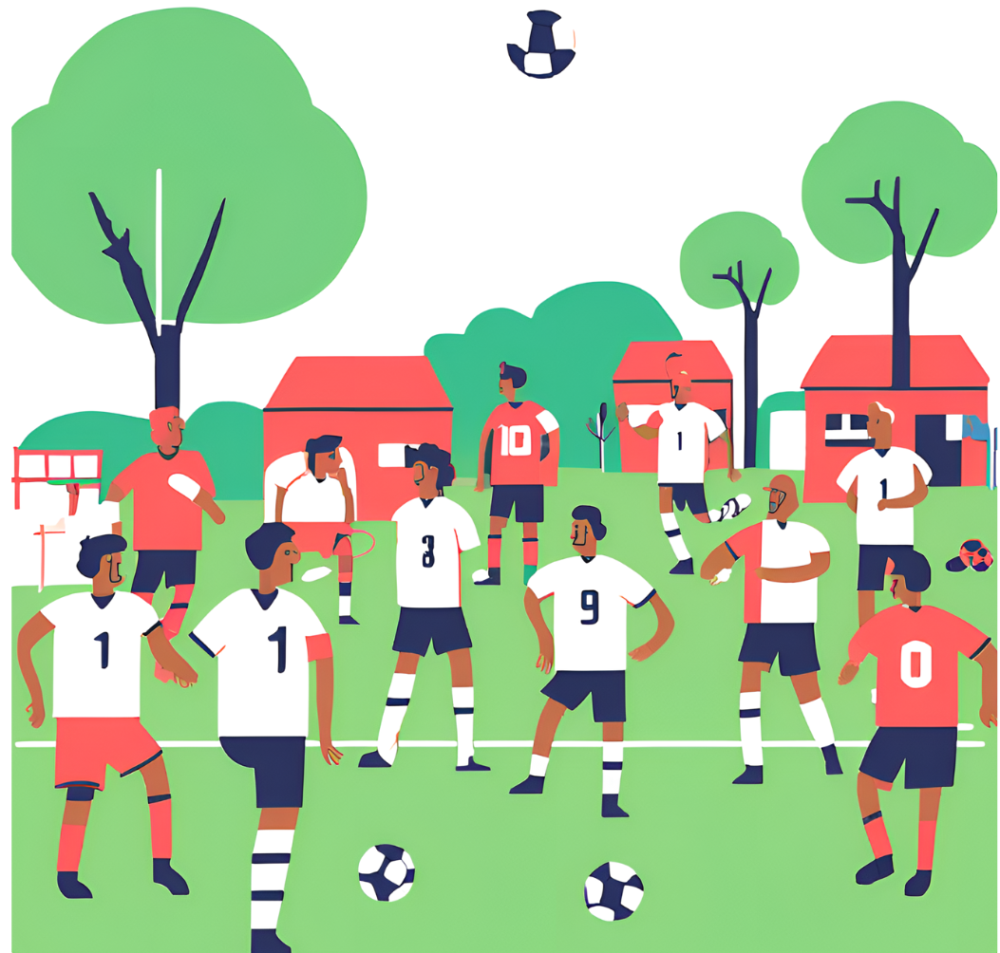

განათლებასთან ერთად ჯანსაღი ცხოვრების წახალისებაც მნიშვნელოვანია, შესაბამისად გადავწყვიტეთ მხარ დავუჭიროთ ონტოფოს სტატდიონის საფეხბურთო სეზონისთვის მომზადებას.

ონტოფოში, ფეხბურთის სეზონი ივლისის მესამე კვირიდან იწყება. ამ დღეებისთვის ყველა ვემზადებით. 
ჩვენი საამაყო სტადიონის მოსაწესრიგებლად ყველა დარაზმულია და ჩვენც გადავწყვიტეთ ამ პროცესში ჩვენი წვლილი შევიტანოთ, კერძოდ, ფეხბურთის კარებისთვის ბადეები შევიძინოთ.

იდეის ფინანსური მხარდამჭერები 👇

<div class="layout-chunk" data-layout="l-body">

```{=html}
<div class="datatables html-widget html-fill-item" id="htmlwidget-2d0aa2e1da12975d08a6" style="width:100%;height:auto;"></div>
<script type="application/json" data-for="htmlwidget-2d0aa2e1da12975d08a6">{"x":{"filter":"none","vertical":false,"data":[["1","2","3","4","5","6"],["თამარ ნადარეიშვილი","თემურ გუგუშვილი","ლალი ჩხეტია","ლელა ნადარეიშვილი","ნათია კეკენაძე","სალომე გოჩოლეიშვილი"]],"container":"<table class=\"hover cell-border stripe dt-head-right\">\n  <thead>\n    <tr>\n      <th>N<\/th>\n      <th>სახელი, გვარი<\/th>\n    <\/tr>\n  <\/thead>\n<\/table>","options":{"searching":false,"pageLength":15,"dom":"Bfrtip","columnDefs":[],"order":[],"autoWidth":false,"orderClasses":false,"lengthMenu":[10,15,25,50,100]}},"evals":[],"jsHooks":[]}</script>
```

</div>


სოფლის სტადიონის განახლების პროცესში ონტოფელები აქტიურად არიან ჩართულები. ეს გახდა ჩვენი მოტივაცია ჩვენი (თქვენთან ერთად)  წვლილი შეგვეტანა ამ პროცესში.


```{.r .distill-force-highlighting-css}
```
