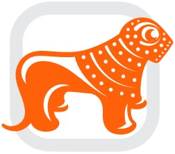

```{r setup, include=FALSE}
knitr::opts_chunk$set(echo = FALSE)

# Learn more about creating websites with Distill at:
# https://rstudio.github.io/distill/website.html

library(ggplot2)
library(tidyverse)
library(hrbrthemes)
library(viridis)
library(ggwordcloud)
library(DT)


```

{width=100%}

მოგესალმებით,

2022 წელს მხარდამჭერების დახმარებით აღდგა [ონტოფოს ბიბლიოთეკის სამზრუნველო](https://ontopo.netlify.app/team.html) და დაიწყო  ბიბლიოთეკის განახლება. ამჯამად ბიბლიოთეკა იღებს National Geographic საქართველოსა და კვირის პალიტრის პერიოდულ გამოცემებს. აგრეთვე, ბიბლიოთეკაში განახლდა საბავშვო წიგნების (ქართული და ინგლისურ ენოვანი) ფონდი.

რა თქმა უნდა, ბიბლიოთეკის განვითარებაზე ზრუნვა გრძელდება და შემდეგ ეტაპზე, იგეგმება წიგნსაცავისთვის ოთახის გარემონტება და სამკითხველო სივრცის ავეჯით მოწყობა.

მოხარულები ვართ, რომ დაინტერესდით მხარი დაუჭიროთ სოფელ ონტოფოში ბიბლიოთეკის აღდგენასა და მის მულტიფუნქციურ სივრცედ ჩამოყალიბებას.


**ფინანსური მხარდაჭერისთვის 👇 **

<div class="warning" style='background-color:#208b9b; color: #ebf4f5; border-left: solid #06707a 4px; border-right: solid #06707a 4px; border-radius: 4px; padding:0.7em;'>
<span>
<p style='margin-top:1em; text-align:center'>
<p style='margin-left:1em;'>

{width=10%}GE08BG0000000161681915 (საქართველოდან)

{width=10%}GE16TB7647745061100123 (საქართველოდან)

{width=10%} (უცხოეთიდან)
</p></span>
</div>


```{r echo = FALSE, show = FALSE,   message = FALSE, warning=FALSE, fig.height = 1, fig.width = 8, dev.args=list(bg='transparent', pointsize=10)}

status <- c("income", "left")
x <- c("same", "same")
gel <- c(1290, 0)

df <- data.frame(status, gel, x)


tg <- ggplot(df, aes(x=x, y=gel, fill = status, color = "#7d9998")) + 
  geom_col(position = position_stack(reverse = TRUE)) +
  geom_text(aes(label = sort(gel)),
            hjust = 0, nudge_x = 0) +
  theme_void()+
  coord_flip()+
  theme(legend.position = "None")+
  scale_fill_manual(values=c("#255251", "white"))+
  scale_color_manual(values=c("#7d9998", "#7d9998"))

```

<p/>

**ბიბლიოთეკის მხარდამჭერები**

```{r echo = FALSE, message = FALSE, warning=FALSE, fig.height = 3.4, fig.width = 8, dev.args=list(bg='transparent', pointsize=10)}


statement <- read.csv("/Users/macbook/Documents/test/ggplot/OnLaibrary/data/statement.csv")


statement_income <- statement %>%
             dplyr::filter(aim == "ჩარიცხვა") %>%
             dplyr::select(c("name")) %>%
  dplyr::distinct()


Table <- datatable(statement_income,  colnames = c("N", "სახელი, გვარი"),
          clas='hover cell-border stripe dt-head-right',
          options = list(searching=FALSE, pageLength=10, dom='Bfrtip'))
Table
```


<div class="warning" style='background-color:#60a2a8; color: #ebf4f5; border-left: solid #06707a 4px; border-right: solid #06707a 4px; border-radius: 4px; padding:0.7em;'>
<span>
<p style='margin-top:1em; text-align:center'>
<p style='margin-left:1em;'>


**სულ შეგროვილია 1570 ₾**

ბიბლიოთეკის მხარდაჭერისთვის დახარჯულია 365 ₾

- პერიოდული გამოცემები 120 ₾

- წიგნები 245 ₾

- ინვენტარი 0 ₾

</p></span>
</div>

